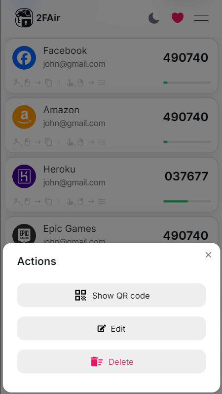
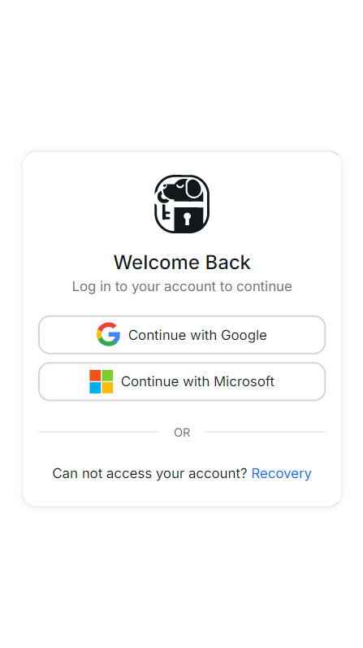
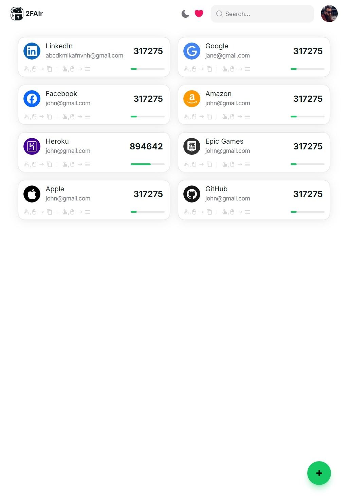

# 2FAir - Cloud Based Two-Factor Authentication Manager

2FAir is a powerful and easy-to-use two-factor authentication (2FA) manager that helps you secure your accounts with OTP (One-Time Password) codes. Manage your 2FA codes, scan QR codes, and generate secure OTPs effortlessly with 2FAir.

## Features

### 1. **Manage OTPs**

Easily add, edit, and delete OTP entries. Store and manage all your OTP codes in one place.

    
    
    

### 2. **QR Code Scanning**

Scan QR codes to quickly add new OTP entries.

    
    

### 3. **Secure and User-Friendly**

Easily accessible with a user-friendly interface.

    
    

### 4. **Multi-Device Support**

Access your OTPs on multiple devices with seamless synchronization.

    
    
    

<!-- ### 5. **Backup and Restore**

Easily backup and restore your OTP data to ensure you never lose access to your accounts.

    
    

 -->
