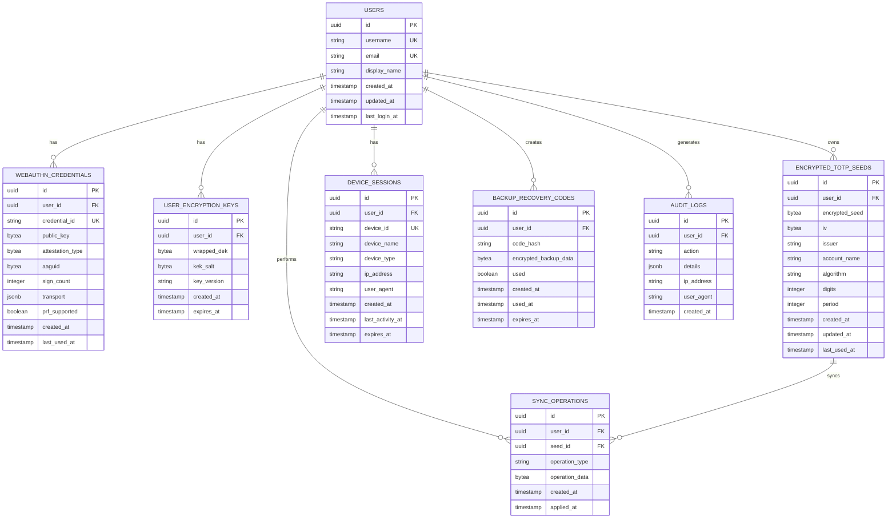

# Design Overview - 2FAir E2E Encrypted TOTP Vault

## Current Implementation Status

### ✅ Phase 1 Complete: Foundation & Infrastructure
- **Backend**: Go 1.23+ with Gin framework, PostgreSQL, SQLC
- **Architecture**: Clean architecture with domain-driven design
- **Security**: Zero-knowledge database schema, no plaintext secrets
- **Development**: Complete Docker environment and development workflow

### 🔄 Phase 2 Ready: Authentication System
Multiple authentication strategies available based on current dependencies:

#### Option A: WebAuthn PRF (Original E2E Design)
- Pure WebAuthn with PRF extension for key derivation
- True zero-knowledge E2E encryption
- Requires adding WebAuthn library back to dependencies

#### Option B: OAuth First (Faster Implementation)
- Leverage existing Goth OAuth library
- Traditional authentication with Google/Microsoft/GitHub
- Upgrade path to WebAuthn encryption later

#### Option C: Hybrid Approach
- OAuth for user authentication
- WebAuthn for vault encryption keys
- Best of both worlds

## System Architecture

### High-Level Components

### Current Database Schema (Implemented)

## Authentication Flow Options

### Option A: WebAuthn PRF Flow (Original Design)

### Option B: OAuth First Flow (Faster Implementation)

### Option C: Hybrid Flow (OAuth + WebAuthn)

## Security Model

### Implemented Security Features ✅
- **Zero-knowledge database**: No plaintext secrets stored
- **Secure middleware**: CORS, CSP, security headers
- **Encrypted connections**: TLS 1.3 enforced
- **Audit logging**: All operations tracked
- **Rate limiting**: Abuse prevention built-in
- **Input validation**: SQL injection prevention
- **Secure session management**: Device tracking

### Phase 2 Security Options

#### Option A: WebAuthn PRF Security
- **Strongest**: True zero-knowledge E2E encryption
- **Key derivation**: WebAuthn PRF → HKDF → KEK → DEK
- **Multi-device**: Synced passkeys across devices
- **Backup**: Encrypted recovery codes

#### Option B: OAuth Security
- **Traditional**: Server-side key management
- **Key derivation**: User password/PIN → KEK → DEK
- **Multi-device**: Server-side key sharing
- **Backup**: Password-protected exports

#### Option C: Hybrid Security
- **Flexible**: OAuth for auth, WebAuthn for vault
- **Progressive**: Start simple, enhance security
- **User choice**: Optional WebAuthn upgrade
- **Fallback**: OAuth if WebAuthn unavailable

## Current Technology Stack

### Backend (Implemented)
- **Language**: Go 1.23+ with toolchain go1.24.2
- **Framework**: Gin HTTP framework
- **Database**: PostgreSQL 15+ with SQLC
- **Migrations**: Goose v3.24.3
- **Configuration**: Environment variables with validation
- **Logging**: Structured JSON logging with slog
- **Available Libraries**:
  - JWT: `github.com/dgrijalva/jwt-go`
  - OAuth: `github.com/markbates/goth`
  - OTP: `github.com/pquerna/otp`
  - MongoDB: `go.mongodb.org/mongo-driver` (if needed)

### Frontend (Planned)
- **Framework**: React 18+ with TypeScript
- **UI Library**: HeroUI (Tailwind CSS based)
- **State Management**: Zustand for global state
- **Data Fetching**: TanStack Query
- **Build Tool**: Vite
- **Package Manager**: Yarn

### Infrastructure
- **Containerization**: Docker + Docker Compose
- **Database**: PostgreSQL with connection pooling
- **Caching**: Redis for session management
- **Development**: Comprehensive Makefile workflow

## Implementation Decision Required

### Phase 2 Authentication Strategy

**Current Dependencies Support:**
- ✅ OAuth (Goth) - Ready to implement
- ✅ JWT (dgrijalva) - Ready to implement  
- ❌ WebAuthn - Would need to add library back
- ✅ TOTP (pquerna/otp) - Ready to implement

**Recommendation**: 
Start with **Option B (OAuth First)** for faster implementation:
1. Implement OAuth authentication with Goth
2. Add traditional key management with user-derived KEK
3. Build core TOTP functionality
4. Add WebAuthn enhancement in later phase

This approach provides:
- ✅ Faster time to market
- ✅ Proven technology stack
- ✅ Good user experience
- ✅ Clear upgrade path to WebAuthn PRF
- ✅ Maintains E2E encryption principles

The foundation is solid and ready for any of these approaches! 🚀 